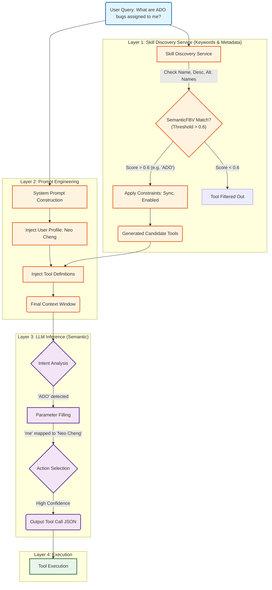

# 链路分析：动态工具选择机制 (Chain Analysis)

基于对 `Log1.json` (单轮 Prompt) 和 `conversationHistory-*.json` (全链路追踪) 的联合分析，我们揭示了 Enterprise Copilot 的 **"漏斗型" 工具选择机制**。

这是一个由 **Skill Discovery Service (技能发现服务)** 进行检索预筛选，再由 **LLM** 进行语义推理决策的多阶段过程。

## 1. 深度机制分析

### A. 第 0 层：技能发现 (The Hidden Retrieval Layer)
*来源：conversationHistory.json*

在 LLM 看到用户的问题之前，系统必须先从成千上万的插件中“检索”出相关的工具。这是一个基于搜索的步骤。
*   **Skill Discovery Service**: 系统运行了一个名为 `EntityServeService` 的请求。
*   **触发条件 (Trigger)**: 系统使用 **SemanticFBV** 算法将 Query 与插件的 Metadata 进行匹配。
    *   **Metadata 包含**: 工具名称 (Name)、描述 (Description)、替代名称 (Alternative Names e.g., "ADO", "Ticket")。
    *   **语义阈值 (Semantic Threshold)**:
        *   **算法**: `SemanticFBV` (Feature Bit Vector)。这是一种基于嵌入向量 (Embedding) 的近似最近邻搜索算法。
        *   **计算方式**: 系统计算 Query 向量与 Metadata 向量之间的 **语义距离 (Semantic Distance)**。距离越小表示越相似（0 表示完全匹配）。
        *   **阈值应用**: 日志明确指出 `MaxSemanticDistanceThreshold: 0.6`。这意味着只有语义距离 **小于或等于 0.6** 的工具才会被认为是候选工具。
        *   **日志证据**: 分析显示 `Feature: search_embedding_distance` 被用于评分。当存在强关键字匹配（如 "ADO"）时，该距离可能被记录为极低值（如 0），优先通过筛选。
    *   **Metadata 详解 (关键匹配源)**:
        1.  **工具名称 (Name)**: 例如 `search_enterprise_connectors_AzureDevOps`。
        2.  **工具描述 (Description)**: 最主要的语义匹配源。例如 *"This connection to Azure DevOps Work items contains tickets to track software development and business projects..."*。
        3.  **替代名称 (Alternative Names/Tags)**: 关键的高权重触发词。这是触发工具最直接的方式，由系统自动聚合生成，包含两部分：
            *   **开发者预定义 (Schema)**: 通用的行业术语，如 `bugs`, `tickets`, `UserStories`, `epics`。这部分是固定的。
            *   **管理员配置 (Instance Name)**: 管理员在部署连接器时配置的 **Connection Name** (注意：**不是最终终端用户**配置，而是企业管理员)。日志中的 `ADO Work Items (O365 Exchange)`, `MSASG`, `Skype` 等均为此类。这使得用户可以通过项目名直接命中工具。
*   **硬约束 (Hard Constraints)**: 日志显示系统应用了严格的过滤条件：
    *   `ConnectorType` 必须是 `"Sync"`。
    *   `ApplicationStateFlags` 不能包含禁用标记。
*   **影响**: 如果用户 Query 没有包含命中 Metadata 的关键词（如 "ADO", "Jira"）或语义距离过远，工具在这一层就会被丢弃，根本不会进入 LLM 的上下文窗口。

### B. 第 1 层：上下文构建 (Context Construction)
*来源：Log1.json*

通过 Skill Discovery Service 筛选出的工具定义被注入到 System Prompt 中。同时注入的还有：
1.  **用户画像 (User Profile)**: `Name: Neo Cheng`, `Job: SENIOR PM MANAGER`.
2.  **工具定义 (Tool Definitions)**: 包含 `search_enterprise_connectors_AzureDevOps` 及其别名列表 ("ADO", "bugs", "WorkItems")。

### C. 第 2 层：LLM 推理与决策 (Inference Layer)
*来源：Log1.json*

LLM 接收到上下文后，执行语义推理：
1.  **意图识别与路由 (Routing)**:
    *   Query: "What are **ADO** **bugs** assigned to **me**?"
    *   Match: "ADO" 和 "bugs" 命中了工具描述中的关键字。
2.  **参数实例化 (Contextual Grounding)**:
    *   代词 **"me"** -> 映射到 User Profile 中的 **"Neo Cheng"**。
    *   术语 **"bugs"** -> 映射到 API 枚举值 **"Bug"**。
3.  **列表意图识别**:
    *   "What are..." 暗示复数，应用规则设置 `response_length='long'`。

### D. 第 3 层：执行与记忆 (Execution & Memory)
*来源：conversationHistory.json (Turn 2)*

*   **Turn 1**: 成功调用工具，返回 20 个 ADO Items。
*   **Turn 2**: 用户追问 *"What are the status distribution..."*。
    *   系统再次运行 Skill Discovery Service，但这次 LLM 决定**不调用新工具**。
    *   **In-Context Learning**: LLM 直接利用上下文中已有的 20 个 Item 数据，自己在内存中计算了状态分布并生成回答。这证明了模型具有 **"上下文优先"** 的特性，除非用户显式要求刷新数据。

## 2. 处理流程图 (Mermaid)

## 3. 结论与优化策略

1.  **关键词至关重要**: **Skill Discovery Service** 层是第一道门槛，必须包含命中插件 Metadata 的关键词（如 "ADO"）。
2.  **上下文实例化**: Prompt 中包含 User Profile 是实现自然语言交互（如用 "me"）的关键。
3.  **显式刷新**: 如果需要最新数据，Query 必须包含打破上下文依赖的词汇（如 "Check latest"），否则模型倾向于使用内存数据。

**Log1.json 记录了 Layer 2 & 3，而 conversationHistory.json 补全了 Layer 1 & 4 的全貌。**
