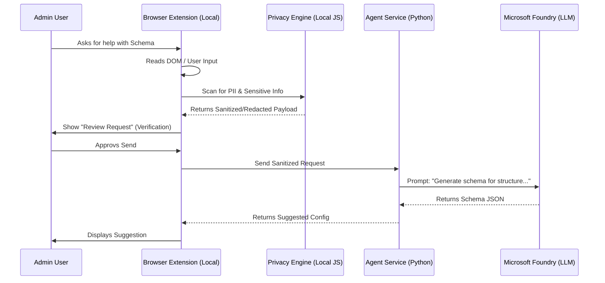

# Product Design: M365 Admin Companion Agent (Browser Extension)

## 1. Overview
The **M365 Admin Companion Agent** is a browser-based intelligent assistant (Extension) that "shadows" M365 Administrators as they navigate the Microsoft Admin Center. Its primary goal is to guide users through the complex flow of creating Graph Connectors, offering contextual advice, schema generation, and error prevention, while maintaining a **Zero-Trust / High-Privacy** security posture.

## 2. Core Value Proposition: Security First
To ensure Admin trust, **Data Security & Privacy** are not just features but the foundation of the UX and Architecture.
*   **Transparency**: The user always knows exactly what data is being read from the screen and sent to the AI.
*   **Control**: Explicit consent is required for data egress.
*   **Isolation**: Sensitive data handling happens locally in the browser whenever possible; only necessary, anonymized contexts are sent to the LLM.

## 3. User Experience (UX) Design
The agent lives in a **Side Panel** in the Edge/Chrome browser, active only on `admin.microsoft.com`.

### 3.1 The "Privacy Shield" Interface
*   **Always-On Status Bar**: Top of the side panel displays a "🔒 Secure Connection" badge.
    *   *Green*: Local processing (No data leaving browser).
    *   *Amber*: Processing with Enterprise Cloud (Azure OpenAI).
    *   *Red*: (Blocked) Unsafe data detected.
*   **Data Egress Preview**: Before the agent helps generate a schema based on user data:
    *   Agent prompts: "I need to analyze a sample of your PDF to suggest a schema."
    *   **"Inspect Payload" Button**: Users can click to see exactly what JSON/Text is being sent.
    *   **PII Masking**: "We have redacted 3 names and 2 emails from the sample before sending."

### 3.2 Workflow Scenarios
1.  **Context Recognition**: 
    *   Admin navigates to *Search & Intelligence > Data Sources*.
    *   Agent recognizes the URL and DOM elements. 
    *   Agent Notification: "I see you're adding a new source. Need help choosing the right connector type?"
2.  **Schema Assistance (The "Trust Moment")**:
    *   Admin is stuck on the JSON Schema screen.
    *   Agent: "Paste a sample JSON entry here. I will remove sensitive values and generate the schema structure for you."
    *   Admin pastes data. Agent highlights redacted fields in UI immediately *before* sending request.

## 4. Architecture: Hybrid B/S (Browser/Server)

### 4.1 Components
*   **Frontend: Browser Extension (TypeScript + React)**
    *   **Content Scripts**: Read Admin Center DOM state securely.
    *   **Privacy Engine (Local)**: A local logic layer that runs Regex/Pattern matching to identify and mask PII (Emails, Credit Cards, Phone Numbers) *inside the browser context* before any network call.
    *   **Side Panel UI**: The chat interface.

*   **Backend: Intelligent Agent Service (Python + Microsoft Agent Framework)**
    *   **Orchestrator Agent**: Receives sanitized context, interacts with Azure OpenAI.
    *   **Stateless Design**: The backend explicitly **does not store** conversation logs or business data request payloads in any persistent database. Memory is ephemeral for the session only.

### 4.2 High-Level Diagram

## 5. Technical Stack
*   **Frontend**: React, TypeScript, Vite, Manifest V3.
*   **Backend**: Python, FastAPI, Microsoft Agent Framework.
*   **AI**: Azure OpenAI (GPT-4o) via **Microsoft Foundry**.
*   **Security Protocol**: TLS 1.3, Ephemeral processing.

## 6. Implementation Stages
1.  **Phase 1: Backend Foundation with Privacy Focus**
    *   Setup Python Agent Framework.
    *   Implement "Stateless" processing logic.
2.  **Phase 2: Frontend Extension Scaffold**
    *   Create Basic React Side Panel.
    *   Implement "Privacy Engine" (Local PII Scrubber) prototype.
3.  **Phase 3: Connection & "Handshake"**
    *   Connect Extension to Backend.
    *   Implement "Payload Inspection" UI.
4.  **Phase 4: Domain Capabilities**
    *   Implement Schema Generation logic specifically for M365 Graph Connectors.
